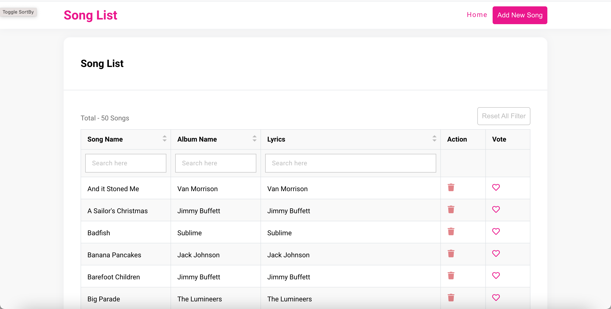

# Songs List - by Mihir Suchak

- Project: Songs List
- Language/Frameworks: _Typescript(with React) + SCSS_

#### Desktop View: Songs List

#### Desktop View: Add Song

## Howdy! 👋

Hey there, this is Mihir Suchak.
## Features Implemented as MVP

- If there is no data then will show no data found error.
- To keep code organized and error-free I did setup locally eslint and prettier.
- Implemented smooth Skelton animation loader.
- Used SCSS so styles can be manged easily.
- Before deleing the song, added confirm dialog box to ask the confirmation.
- User can search and sort individual column, also added reset function so in one go user can reset all the filters.

## Possible Enhancements

- [UI] There is always scope for improvements of design.
- [UI] I did not spend time to make it responsive so we can do that too.
- [TECH] We can use more utility classes using bootstrap or making our own with a tailwind.
- [TECH] Instead of normal scss we can use the .modules pattern for local components.
- [TECH] We can use a custom error boundary component.
- [TECH] In the real project we can use more detailed meta tags, roboto.txt and sitemap to improve SEO.
- [TECH] Show tooltip while toggling vote and upvote.

## Setup & Development

### Prerequisite
- Make sure you have `node` installed -- recommended `15.6.0`.
- Once you have a `node` installed, run `npm install` in this repo to get your dependencies.
- Make sure you have install json-server globally, you can download from [here](https://www.npmjs.com/package/json-server) or run this command `npm install -g json-server`.
-  Once you have a installed json-server, run `npm run server` in terminal, it'll start server in port 8000 and keep this open in one terminal.
- In another terminal run `npm start` app will start on 3000 port.

In the project directory, you can run:

### Description / Data Flow / Approach

- This project was bootstrapped with [Create React App](https://github.com/facebook/create-react-app). Reason: wanted to move quickly since this structure will give me the minimum things I'd need to create an MVP.
- Used scss variables for colors so anytime it can be changed from the one place and it'll reflect at respective places.
- Implemented custom component so we can reuse it anywhere like Button, Table, Input, etc.

Thank you!
